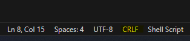
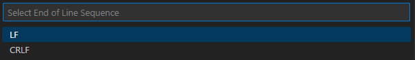
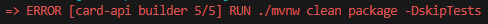

# Cards API

## _API de dados para o frontend Mibess Cards_

Essa é a api de dados do nosso frontend Mibess Cards. Desenvolvida utilizando Spring Boot com ela podemos listar, cadastrar, editar e excluir um pensamento.

**Requisitos**

[Spring Boot](https://start.spring.io/) versão >= 3.2.0.

[Docker](https://www.docker.com/get-started/) versão >= 24.0.6

[PostgreSQL](https://www.postgresql.org/download/) versão >= 15.5 - Apenas para referência, na instalação utilizamos uma versão conteinizada.

[Mibess Frontend](https://github.com/mibess/mibess-cards) Aplicação frontend.

**Obs:- Esse é apenas o backend da aplicação!**
Sugiro baixar a aplicação completa nesse repositório: [Cards MS](https://github.com/mibess/cards-ms)

## Endpoints da API

### _GET /cards_

Lista todos os cards
**Exemplo de Saída**

### - Response 200 ok

```
[
    {
        "code": "225635bf-931a-4dde-aeb1-1d401599cde9",
        "content": "Olha esse lindo pensamento",
        "author": "Mibess Dev",
        "model": "model1",
        "createdAt": "04/12/2023 16:20:46"
    }
]
```

### _POST /cards_

Cria um card novo
**Exemplo de Entrada**

```
@Body exemplo -> criar um novo card
{
    "content": "Criando mais um Pensamento!",
    "author": "Mibess Dev",
    "model": "model1"
}
```

**Exemplo de Saída**

### - Response 201 created

```
{
    "code": "93d73a0b-a942-4f57-a9f4-40c345a58ab8",
    "content": "Criando mais um Pensamento!",
    "author": "Mibess Dev",
    "model": "model1",
    "createdAt": "11/12/2023 23:28:44"
}
```

### _PUT /cards/{cardCode}_

Atualiza um card pelo código enviado
**Exemplo de Entrada**

```
@Body exemplo -> atualizar um card
{
    "content": "Esse card irá ser atualizado!",
    "author": "Mibess Dev",
    "model": "model2"
}
```

**Exemplo de Saída**

### - Response 200 ok

```
{
    "code": "93d73a0b-a942-4f57-a9f4-40c345a58ab8",
    "content": "Esse card irá ser atualizado!",
    "author": "Mibess Dev",
    "model": "model2",
    "createdAt": "11/12/2023 23:28:44"
}
```

### _DELETE /cards/{cardCode}_

Deleta um card pelo código enviado
**Exemplo de Saída**

### - Response 204 no content

```

```

**Acesse a API em Produção**

### Cards -> https://cards-api.mibess.com.br/

# Instalação

1 - Clone o repositório do GitHub

```
git clone https://github.com/mibess/card-api.git
```

2 - Entre na pasta da aplicação

```
cd card-api
```

3 - Caso esteja usando o VS code fique atento a configuração dos seus arquivo!



**Altere para LF pois algum arquivo pode gerar erro de compilação**
**No arquivo .editorconfig já está configurado para LF**



**Exemplo de erro**



4 - Agora execute o comando abaixo:

```
docker compose up -d --build
```

5 - Acesse a aplicação
http://localhost:8080

### Agora você deve estar pronto para usar o Cards API localmente em sua máquina!
